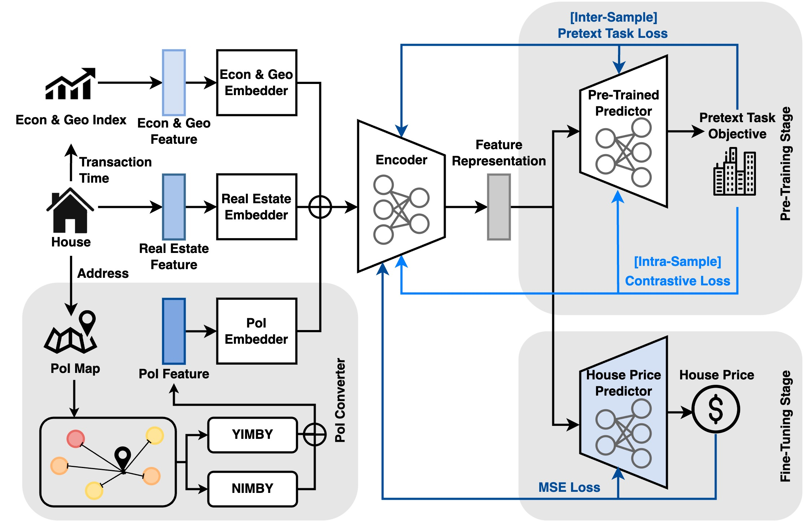

# DoRA: Domain-Based Self-Supervised Learning Framework for Low-Resource Real Estate Appraisal (CIKM 2023)
Official code of the paper **DoRA: Domain-Based Self-Supervised Learning Framework for Low-Resource Real Estate Appraisal**. Paper link: http://arxiv.org/abs/2309.00855.

## Overview
DoRA is pre-trained with an intra-sample geographic prediction as the pretext task based on the metadata of the real estate for equipping the real estate representations with prior domain knowledge. And, inter-sample contrastive learning is employed to generalize the representations to be robust for limited transactions of downstream tasks.

## Model Framework


## Model Training
```
python DoRA.py {building_type} {num_shot}
```
{building_type} = ```'building', 'apartment', 'house'``` <br>
{num_shot} = ```1, 5, ...```
